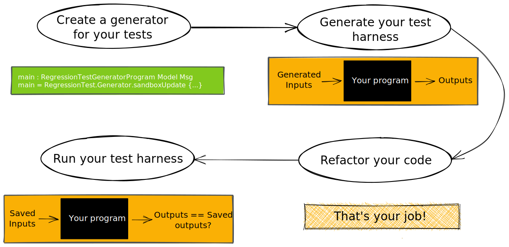

<h1 align="center">♻️ Elm Regression Testing ♻️</h1>

> Refactor that obscure piece of code that nobody can understand anymore!

## What is it?

Imagine you start a new job on an already existing product. The former and only developer of the solution hands you over the source code and runs to the exit, leaving you wondering what is happening...
And then you look at the code and damn! You didn't even know it was possible to write bad code in Elm, but here it is. The most obfuscated human-written code you've ever seen!

The product won't survive if you can't refactor this to improve the code. Fortunately this is Elm so refactoring is easy, right? Wait a minute, what does this function do? And this one? And what the heck is this type representing? Nor the naming nor the types help you in any way to understand what is happening here.

You just know the current implementation works and that you should not break it. You have to refactor without altering a behaviour you don't know. How to do that?

You've guessed it! **Regression testing**!

## When do I need regression testing?

When you need to refactor a code without knowing exactly what this code does. This could be because it's not your code and you do not have the specifications, or maybe because the code has grown more and more complex overtime and nobody knows everything anymore. The only thing you now is that the current implementation is considered correct and you do not want to break it while refactoring it.

In fact, even if there are bugs in this piece of code, you don't want to fix them during this refactoring: this is something that you will address later, once the code is easier to work with: *[make the change easy [...] then make the easy change](https://twitter.com/kentbeck/status/250733358307500032?lang=fr) (piece of wisdom from Kent Beck).* [Discover more on this thanks to Dillon Kearns](https://medium.com/@dillonkearns/moving-faster-with-tiny-steps-in-elm-2e6a269e4efc).

If you know well what your code is supposed to do, unit tests or fuzz tests through [`elm-test`](https://package.elm-lang.org/packages/elm-explorations/test/latest/) directly may suit you better.    

## How does it work?



Well, you can take your program, generate an initial model, generate random messages, send them to your update method and save the final model. Without knowing exactly what happened, you now have a test that – given an initial model and some inputs – produces a specific output. Now, generate 100s of them, and save the inputs and the output to run them later again. Refactor the part of the code that you want, and once done run the tests again, comparing the final output with the previous final output. Are they the same for every test? Great, you have improved the code without breaking anything! Some tests don't pass? You've just changed the behaviour and should try to fix that mistake!

These generated tests are called a *test harness* and are here to help you improve the code. We can see four steps:

 1. Create a generator for your test harness
 2. Generate and save the test harness
 3. Refactor your code
 4. Re-run the tests and compare the outputs with saved outputs
 
If this package can't help you for step 3 (this is your job!), it can help you for the other steps. Let's see how.

In the following examples, let's imagine that we want to build a test harness for [the counter program](https://elm-lang.org/examples/buttons).

## Create a generator for your test harness

This package will help you generate tests, but it needs a few inputs from you:

 - We need to know how to generate an initial model for your program: your job is to create a generator using the [`elm/random` package](https://package.elm-lang.org/packages/elm/random/latest/). Let's see an example for the counter program:
   
   ```elm
   import Random exposing (Generator)
   import Counter exposing (Model)
   
   modelGenerator : Generator Model
   modelGenerator = Random.int -10 10
   ```
   
   Or if your initial model is always the same, you can use a constant generator:

   ```elm
   modelGenerator : Generator Model
   modelGenerator = Random.constant 0
   ```   
 - Define how to generate a message for your application:
   ```elm
   import Counter exposing (Msg(..))
   import Random exposing (Generator)
   
   modelGenerator : Generator Msg
   modelGenerator = Random.uniform Increment [Decrement]
   
   -- If some messages should be more frequent than others, you can use Random.weighted.
   ```
 - Define how encode your model and your messages into JSON to save them, using the [`elm/json` package](https://package.elm-lang.org/packages/elm/json/latest/). 
   ```elm
   import Counter exposing (Model, Msg(..))
   import Json.Encode as Encode
   
   encodeModel : Model -> Encode.Value
   encodeModel model = Encode.int model
   
   encodeMessage : Msg -> Encode.Value
   encodeMessage msg =
       case msg of
           Increment ->
               Encode.string "INCREMENT"
           Decrement ->
               Encode.string "DECREMENT"
   
   -- You can find more complex examples in the "examples" folder
   ```
 - Declare a port to get back the generated tests:
   ```elm
   port module RegressionTestGenerator exposing (main)
   import Json.Encode as Encode
   
   -- The name is important, it should be "outputPort"
   port outputPort : Encode.Value -> Cmd msg
   ```

Once you have everything ready, you can create the generator:

```elm
port module RegressionTestGenerator exposing (main)

import Counter exposing (Model, Msg, update)
import RegressionTest.Generator exposing (RegressionTestGeneratorProgram)

main : RegressionTestGeneratorProgram Model Msg
main = RegressionTest.Generator.sandboxUpdate
    { modelGenerator = modelGenerator
    , messageGenerator = messageGenerator
    , update = update
    , encodeModel = encodeModel
    , encodeMessage = encodeMessage
    , outputPort = outputPort
    , numberOfTests = 500
    }
```

## Generate and save the test harness

We're going to use the node module to generate this one, so you'll need to have [NodeJS](https://nodejs.org/en/) installed. Then, you can install the tool:

```bash
npm install --global @jgrenat/elm-regression-testing
```

To generate the tests, go to the root of your project, assuming that the `TestGenerator` file is in the `tests` directory, run this command:

```bash
elm-regression-testing ./tests/RegressionTestGenerator.elm
```

This will generate the file `./tests/GeneratedRegressionTestData.elm` containing the tests data. If you want to change the path or the name of the file, you can use the `--output` option:

```bash
elm-regression-testing ./tests/RegressionTestGenerator.elm --output=./tests/CustomFileName.elm
```


## Refactor your code

I'm afraid I won't be of any help here, you don't want me to take your job anyway... 😁


## Re-run the tests and compare the outputs with saved outputs

The tests data have been saved, now we need to re-run these tests and compare the results.

For that, we need to know how to decode the model and the messages from the generated JSON:

```elm
import Counter exposing (Model, Msg(..))
import Json.Decode as Decode exposing (Decoder)

modelDecoder : Decoder Model
modelDecoder = Decode.int

messageDecoder : Decoder Msg
messageDecoder =
    Decode.string
    |> Decode.andThen (\messageType -> 
        case msg of
            "INCREMENT" ->
                Decode.succeed Increment
            "DECREMENT" ->
                Decode.succeed Decrement
            _ ->
                Decode.fail ("Invalid message: " ++ messageType)
    )
  
-- You can find more complex examples in the "examples" folder
```

Then, you can create a runner:

```elm
module RegressionTestRunner exposing (suite)

import Counter exposing (update)
import GeneratedRegressionTestData exposing (testData)
import RegressionTest.Runner
import Test exposing (Test)


suite : Test
suite = 
    RegressionTest.Runner.element 
        { modelDecoder = modelDecoder
        , messageDecoder = messageDecoder
        , update = update
        } testData
  
```

And launch it as usual through:

```bash
elm-test
```

This requires that at some point you've set up [`elm-explorations/test`](https://package.elm-lang.org/packages/elm-explorations/test/latest/) for your project.

## I want to refactor my model / my messages! 😱

If you want to change the representation of your model or change the messages of your app, there is no problem, your test harness is still there!

As the test data are stored as JSON, you can decode it as you want!

Let's imagine that you want to change the model in the Counter example to allow adding more informations in the future:

```elm
-- Previous Model was simply an Int, we want to use a record containing that Int after our refactoring:

type alias Model = { value : Int }
```

You can change your decoder to follow this change:

```elm
modelDecoder : Decoder Model
modelDecoder = 
    Decode.int
    |> Decode.map Model
```

And run your tests with `elm-test`!
